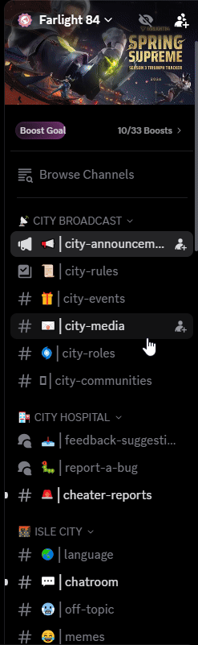

<div align="center">

# ChPeek

**Peek behind Discord's curtain — see every channel in a server, even the ones you can't open.**

[](https://vencord.dev)
[](https://www.typescriptlang.org/)
[](https://react.dev/)
[](LICENSE)
[](https://vencord.dev)

[](https://github.com/axs-offcl/ChPeek/commits)
[](https://github.com/axs-offcl/ChPeek)
[](https://github.com/axs-offcl/ChPeek)

A [Vencord](https://vencord.dev) plugin that reveals the hidden channels of a server and shows you exactly who is allowed in each one — without ever joining, connecting to, or leaking anything.

</div>

---

## Demo

<div align="center">



*Hidden channels revealed in the sidebar, each marked as off-limits, with the reveal toggle in the server header.*

</div>

---

## Features

- **Reveals every channel** — text, announcement, forum, voice, and stage channels you have no permission to view.
- **Two display styles** — a clean **lock icon**, or a **muted channel with a crossed-out eye** that looks like a normal muted channel.
- **Smart lock screen** — open a hidden channel and you get a read-only overview instead of a broken or empty chat: topic, who may access it, pinned/forum metadata, and the channel's emoji.
- **Allowed users & roles, expanded by default** — see the full allowlist of a hidden channel without clicking "show more", and `@everyone` is resolved correctly.
- **One-click toggle in the server header** — sits right next to the Invite button, no digging through settings.
- **Hides unread badges** on channels you can't read, so hidden channels don't tease you.
- **Safe by design** — never connects to a hidden voice/stage channel, never fetches messages from it, hides edit/invite buttons, strips hidden channels from keybind navigation, and does not follow mentions into them.
- **Instant on/off** — flipping the toggle patches or unpatches with no client restart required.

## Installation

> Requires the [Vencord](https://vencord.dev) desktop client plugin.

1. Open Vencord **Settings → Plugins**.
2. Click **Open Folder** (or `Ctrl/⌘ + Shift + P` → `Plugins` in Discord's Quick Folder) to open Vencord's `plugins` directory.
3. Clone or download this repository into that directory as `ChPeek`:

   ```bash
   git clone https://github.com/axs-offcl/ChPeek.git
   ```

4. Restart Discord (or run `/reload` in Discord with Vencord's dev tools).
5. Enable **ChPeek** in **Settings → Plugins → ChPeek**.

> Some Vencord builds block unsigned third-party plugins. If ChPeek doesn't show up, allow the folder in `Settings → Advanced → Plugin Loader`, or build it into your Vencord checkout under `src/plugins/ChPeek`.

## Settings

| Option | Default | Description |
| --- | --- | --- |
| **Reveal hidden channels** | `on` | Master switch. Also bound to the header button. |
| **Show button in server header** | `on` | Render the reveal toggle next to Invite. |
| **Show advanced options** | `off` | Reveals the options below. |
| **Hide unread badges** | `on` | Don't show unread counts on channels you can't view. *(needs restart)* |
| **Channel style** | `Lock icon` | `Lock icon` or `Muted, with hidden icon`. *(needs restart)* |
| **Open allowed-members list by default** | `on` | Show who may access a hidden channel without expanding it. |

## How it works

ChPeek hooks Discord's own channel permission pipeline with Vencord patches:

1. `GuildChannelStore` stops hiding channels you lack `VIEW_CHANNEL` for, while every other Discord call site keeps filtering them back out.
2. The channel list's row builder is wrapped so hidden channels render at the same level as visible ones — the scroller's section heights stay in sync, so the sidebar doesn't jitter.
3. Channel navigation, message fetching, voice connection, and mention handling are all short-circuited for hidden channels.
4. A custom `HiddenChannelLockScreen` component takes over the chat, voice, and stage views, rendering Discord's own allowed-users-and-roles modal content against a lock.

Because it never requests a hidden channel's content, ChPeek only ever shows you metadata the server has already sent your client.

## Credits

- Built on [Vencord](https://github.com/Vencord/Vencord) by Vendicated and contributors.
- Derived from Vencord's **ShowHiddenChannels** plugin, extended with the lock screen, header toggle, hidden-channel styling, and permission-accuracy fixes.

## License

Released under the [GNU General Public License v3.0](LICENSE).

Copyright &copy; 2026 axs-offcl

<p align="center">
  <sub>Not affiliated with Discord Inc. or Vencord. Use at your own risk.</sub>
</p>
